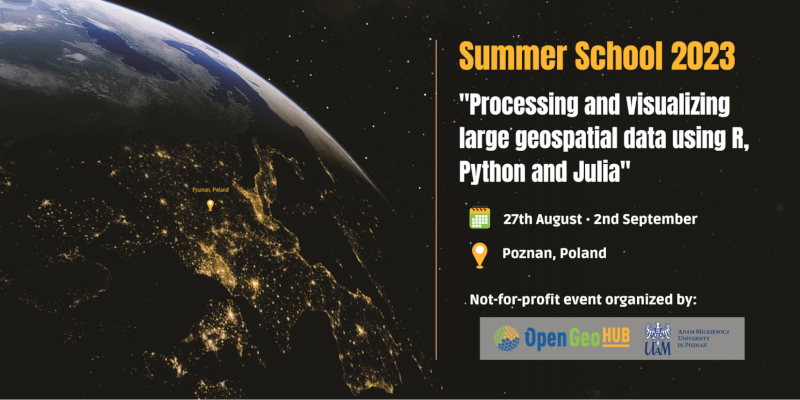

## [**27 August -- 02 September 2023, OpenGeoHub Summer School 2023, Poznań**](https://opengeohub.org/summer-school/opengeohub-summer-school-poznan-2023/)

### Robin Lovelace: "Tidy geographic data with sf, dplyr, ggplot2, geos and friends"

- [Workshop materials](https://github.com/Robinlovelace/opengeohub2023)

### Michael Dorman: "Introduction to working with spatial data in Python"

- [Workshop materials](https://geobgu.xyz/presentations/p_2023_ogh/)

### Edzer Pebesma: "Raster and vector data cubes in R"

- [Workshop materials](https://github.com/edzer/OGH23)

### Marteen Pronk: "Processing geospatial data using JuliaGeo framework"

- [Workshop materials](https://github.com/evetion/OGH2023)

### Krzysztof Dyba: "Unsupervised classification (clustering) of satellite images"

- [Workshop materials](https://kadyb.github.io/OGH2023/)

### Roger Bivand: "Progress in modernizing and replacing infrastructure packages in R-spatial workflows"

- [Workshop materials](https://r-spatial.github.io/evolution/ogh23_bivand.html)

### Lorena Abad: "Tools and packages to query and process Sentinel-1 and Sentinel-2 data with R and Python"

- [Workshop materials](https://github.com/loreabad6/ogh23)

### Caitlin Haedrich: "Parallelization of geoprocessing workflows in GRASS GIS and Python"

- [Workshop materials](https://github.com/ncsu-geoforall-lab/opengeohub-2023)

###  Ewa Grabska-Szwagrzyk: "Environmental analysis using satellite image time series"

- [Workshop materials](https://github.com/egrabska/OGH2023)

### Alicja Balfanz: "xcube for spatiotemporal data analysis and visualization"

### Alexander Brenning: "Spatial ML model assessment and interpretation"

### Jarosław Jasiewicz: "Mapping explanation - Python toolchaing for spatial interpretative machine learning"

### Edzer Pebesma: "Cloud-based analysis of Earth Observation data using openEO Platform, R and Python"

### Anita Graser: "Data engineering for Mobility Data Science (with Python and DVC)"

- [Workshop materials](https://github.com/movingpandas/movingpandas-examples/tree/opengeohub2023)

### Robin Lovelace: "Processing large OpenStreetMap datasets for geocomputational research"
